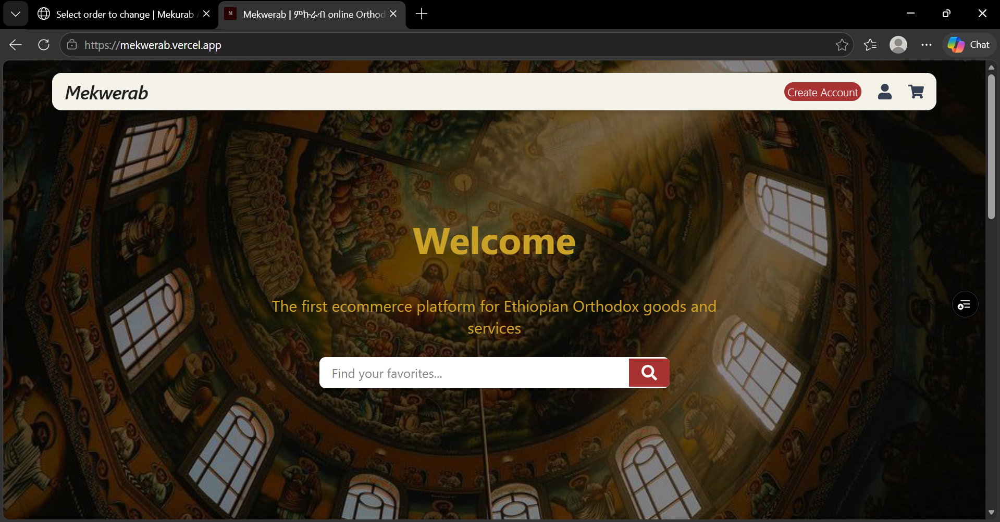
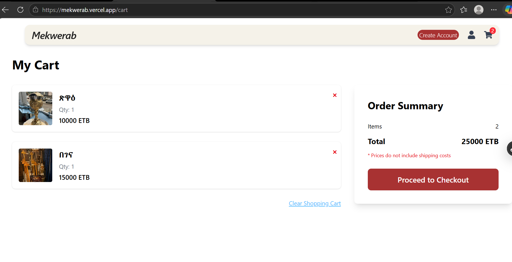

# 🛒 Mekwerab | ምኵራብ Ethiopian Orthodox E-commerce platform

### This project structured as two independent repository
 Backend API: https://github.com/IyosiTes/Mek
## 🌐 Frontend 
###  overview
Frontend application for the Ethiopian Orthodox e-commerce platform, delivering a modern, responsive user experience for browsing and purchasing religious goods and services.
###  Features  
- 🔍 Product browsing & advanced filtering  
- 🛒 Cart management system  
- 📦 Seamless order flow integration  
- 🔗 API-driven architecture
### Tech stack
- ⚛️ **React** — Component-driven modern frontend architecture  
- 📘 **TypeScript** — Type-safe development for better scalability  
- 🎨 **Tailwind CSS** — Utility-first styling for rapid modern UI design  
- ⚡ **Vite** — Lightning-fast build tool and development server
## 📸screenshots
<p align="center">
  
  
</p>

### setup
```bash
 npm install
 npm run dev
```
## check live
Check out the live project on Vercel: https://mekwerab.vercel.app

## Contact
-  Developed by: Eyosias Tesfaye
-  Email: iyosiastesfaye@gmail.com
-  Telegram: https://t.me/Iyosi_tes
